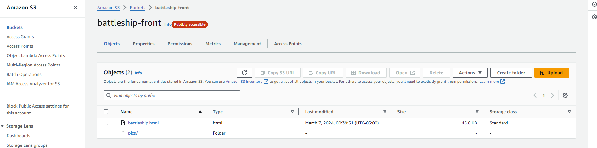
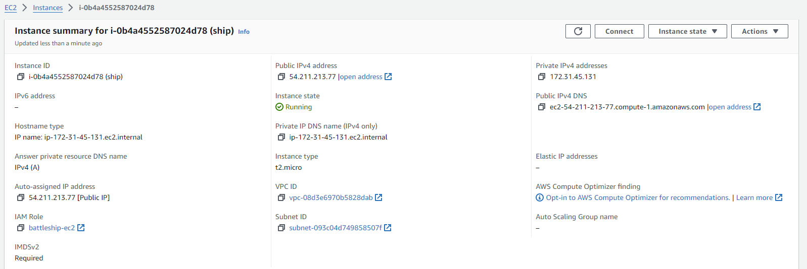
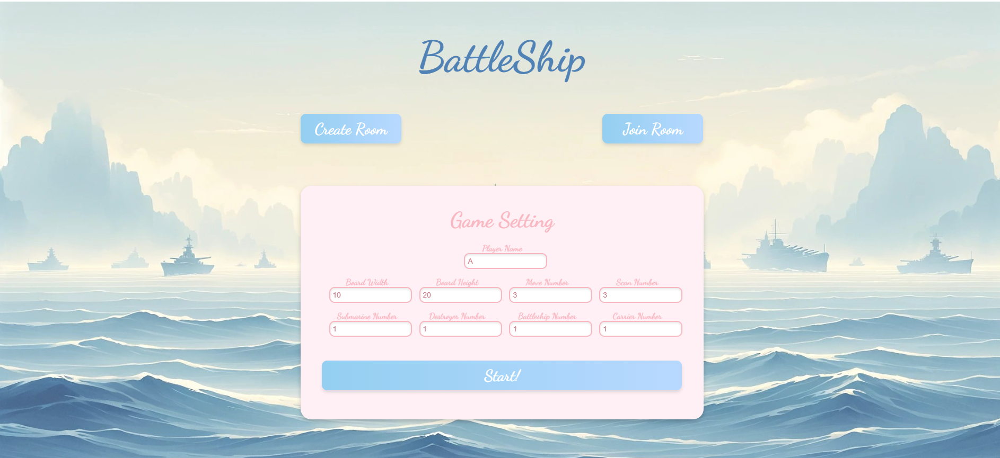
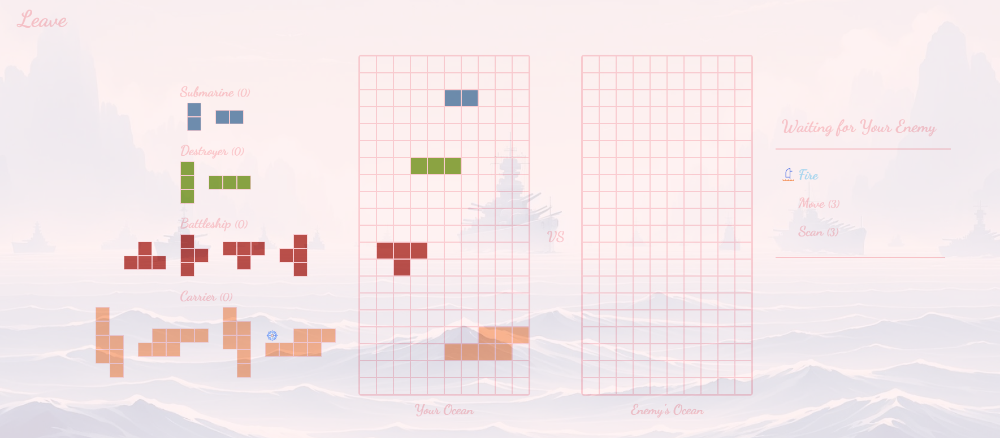
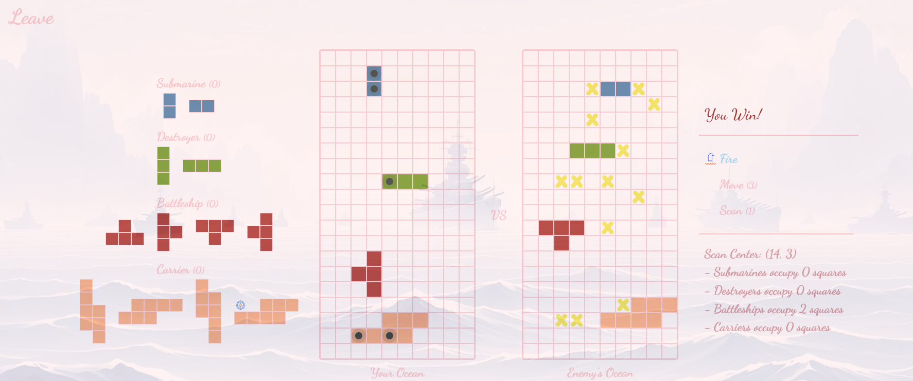
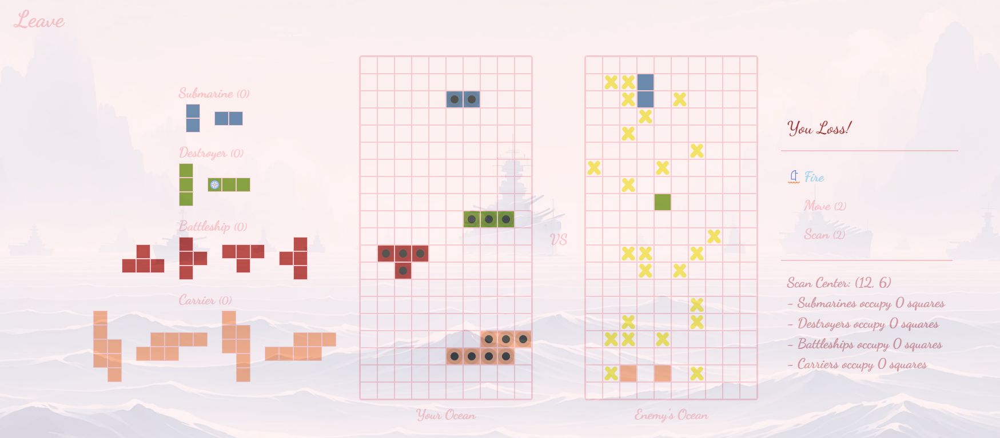

# Battleship
A battleship game website where multiple players can play at the same time.

## Demo
[http://battleship-front.s3-website-us-east-1.amazonaws.com/](http://battleship-front.s3-website-us-east-1.amazonaws.com/)

## Tech Stack
1. java
2. gradle
3. spring
4. socketio
5. js/html/css
6. AWS

## Deploy (AWS)
1. Front-end: ```Amazon S3```

2. Back-end: ```Amazon EC2```


## Functionality
1. Setup
- Players must either create or join a game room.
- Each player places their fleet of ships within their own ocean grid. To do this, click on the ship you want to place from the left side of the screen, then click on the spot in your grid where you want to position it.
2. Starting the Game
- Once both players have positioned all their ships, the game begins.
3. Game Actions
- Fire: This action allows you to attack a single cell in the opponent's grid in an attempt to hit and eventually sink their ships.
- Move: This option lets you reposition your own ships within your grid.
- Scan: Use this to reveal information about the ships in the opponent's grid.
4. Winning the Game
- The goal is to sink all of the opponent's ships. The first player to do so wins the game.\
\
**The game has many intricate details and features that players are encouraged to discover as they play. Remember, each turn allows you to strategize and choose the best course of action based on the situation at hand. Enjoy the game!**

## Game Screenshots




